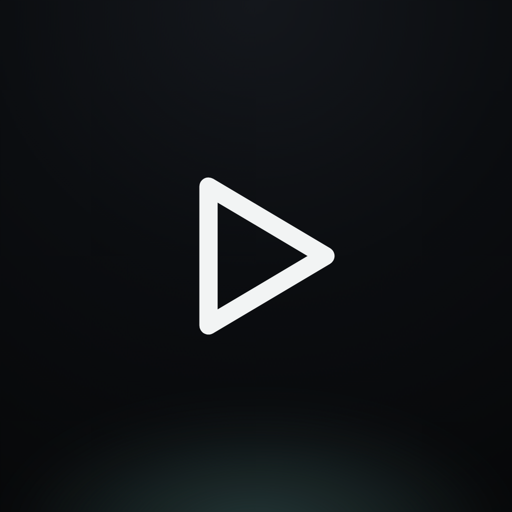
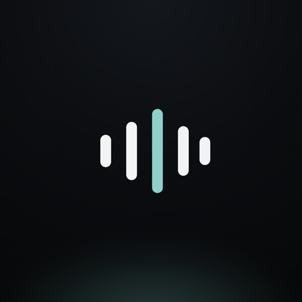
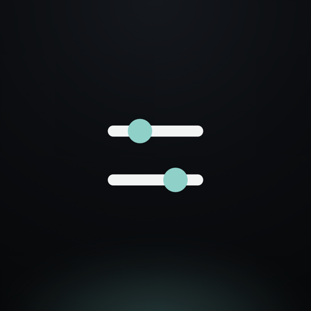
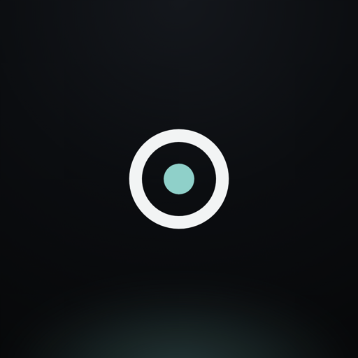
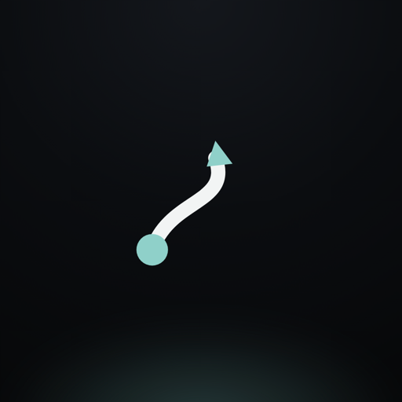
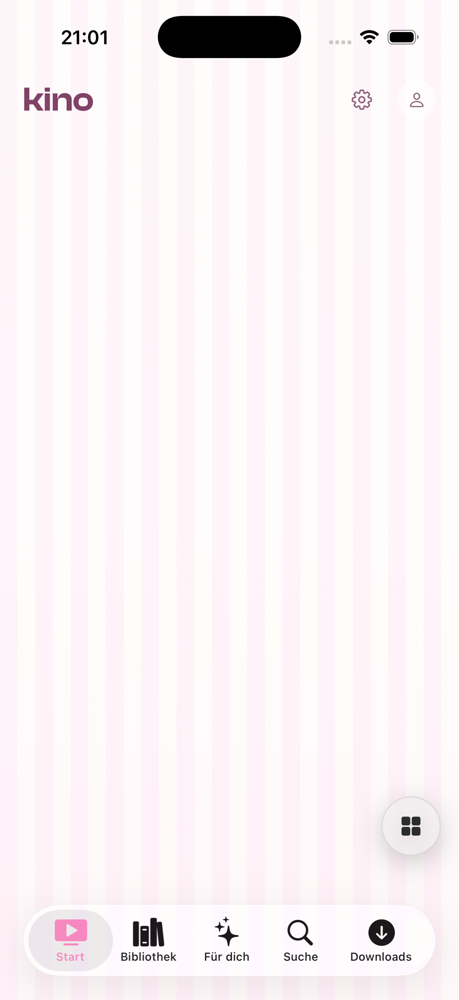
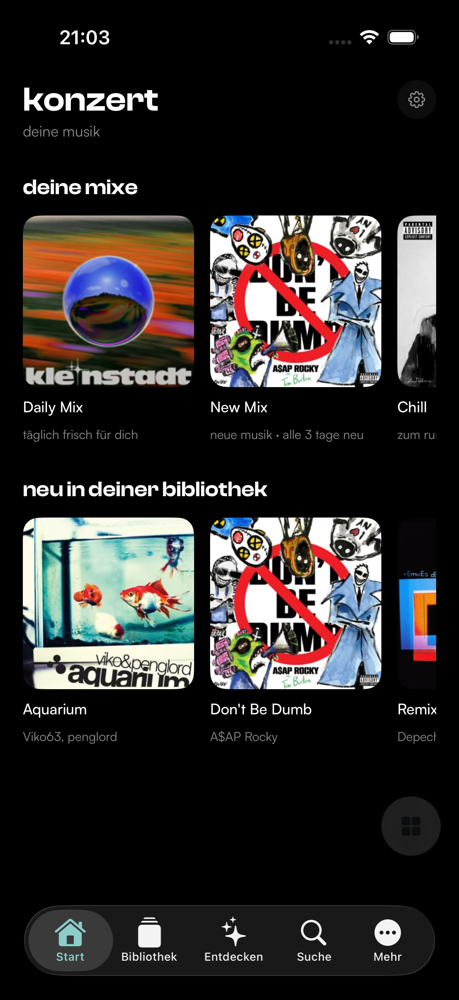
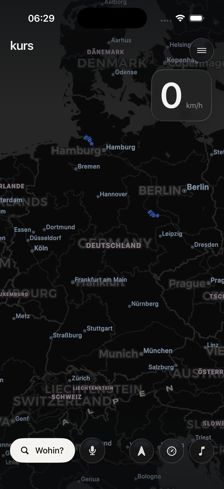

<div align="center">

# Kinekt

**Fünf Apps · eine Identität.** Privat gehostet, kabellos installierbar über **SideStore / AltStore** — kein Kabel, keine App-Store-Freigabe.

    

</div>

---

## 📲 Installieren (SideStore / AltStore)

1. **SideStore** auf iPhone/iPad einrichten (iOS **26+**).
2. Tab **Sources → +** und diese URL einfügen:

   ```
   https://raw.githubusercontent.com/nicolasjankovich-netizen/kinekt-apps/main/apps.json
   ```

3. **Browse** → App wählen → **Install**. Fertig — komplett über die Luft.

> Gratis-Signing hält 7 Tage; SideStore signiert im Hintergrund automatisch nach. Kein Kabel nötig.

---

## Die Apps

###  Kino — *Filme & Serien*
Private Film- & Serien-Mediathek (Jellyfin) mit Login, Profilen, Downloads und Apple-TV-Ausgabe.
<br>

###  Konzert — *Deine Musik*
Musik-Streaming (Navidrome) im Apple-Music-Stil: Playlists, Downloads, AirPlay & Cast. **Eigener Musik-Account nötig.**
<br>

###  Kern — *Persönlicher Assistent*
Kalender, Aufgaben, Notizen (PencilKit) & KI-Assistent. **Eigener Server-Token nötig** (Mehr → Server-Token).

###  Kommando — *Server-Steuerung*
Steuere deinen Heim-Server (TrueNAS, Jellyfin, Dienste, Minecraft). **Eigener Server-Login nötig.**

###  Kurs — *Navigation*
CarPlay-Ersatz fürs iPad/iPhone: Navigation, Blitzer-Warnungen, Tempo, Tankstand & Musik-HUD.
<br>

---

## Hinweise

- **iOS 26+** — die Apps nutzen echtes Liquid Glass (`.glassEffect`).
- Jede App hat einen **2FA-/Login-Schutz**; es sind **keine Zugangsdaten eingebacken** (deshalb Login).
- **Kino** = eigenes Profil-Login · **Konzert** = Navidrome-Login · **Kern** = Server-Token · **Kommando** = Server-Login.
- Design: eine Kinekt-Familie (Clash Display + Satoshi, Mint-Akzent `#6FB0AB`, dunkles Glas).

<div align="center"><sub>© Nicolas · nur für Freunde. Keine kommerzielle Nutzung.</sub></div>
